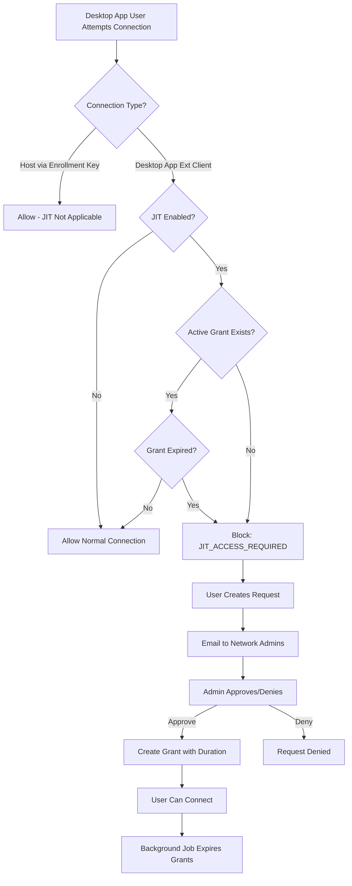

# Just-In-Time (JIT) Network Access Implementation Plan

## Overview

This plan implements a complete JIT access control system for Netmaker networks, allowing network admins to enforce time-bound, approval-based access. When enabled, users must request access and receive admin approval before connecting.

## Architecture



## Implementation Components

### 1. Database Schema

**New Table: `jit_requests`**

- Store JIT access requests with status (pending, approved, denied)
- Fields: `id`, `network_id`, `user_id`, `user_name`, `reason`, `status`, `requested_at`, `approved_at`, `approved_by`, `duration_hours`, `expires_at`

**New Table: `jit_grants`**

- Store active access grants
- Fields: `id`, `network_id`, `user_id`, `request_id`, `granted_at`, `expires_at`, `is_active`

**Location**: Create schema files in `schema/jit_request.go` and `schema/jit_grant.go` following the pattern of `schema/egress.go`

### 2. Network Model Updates

**File**: `models/network.go`

- Add field: `JITEnabled string` (following "yes"/"no" pattern like `DefaultACL`)
- Update `SetDefaults()` to set `JITEnabled = "no"` if empty

### 3. API Endpoints

**File**: `controllers/jit.go` (new file)**Base URL**: `/api/v1/jit`**All endpoints require**:

- `network_id` query parameter
- Authentication header with valid user token
- JIT feature flag must be enabled

#### 3.1 Enable JIT on Network

**Endpoint**: `POST /api/v1/jit?network_id={network_id}`**Request Body**:

```json
{
  "action": "enable"
}
```

**Response** (200 OK):

```json
{
  "code": 200,
  "message": "JIT enabled on network",
  "response": null
}
```

**Error Responses**:

- `403 Forbidden`: JIT feature not enabled, or user is not a network admin
- `400 Bad Request`: Missing network_id or invalid request body
- `500 Internal Server Error`: Server error enabling JIT

---

#### 3.2 Disable JIT on Network

**Endpoint**: `POST /api/v1/jit?network_id={network_id}`**Request Body**:

```json
{
  "action": "disable"
}
```

**Response** (200 OK):

```json
{
  "code": 200,
  "message": "JIT disabled on network",
  "response": null
}
```

**Error Responses**: Same as Enable JIT---

#### 3.3 Create JIT Access Request

**Endpoint**: `POST /api/v1/jit?network_id={network_id}`**Request Body**:

```json
{
  "action": "request",
  "reason": "Need access to debug production issues"
}
```

**Response** (200 OK):

```json
{
  "code": 200,
  "message": "JIT access request created",
  "response": {
    "id": "550e8400-e29b-41d4-a716-446655440000",
    "network_id": "mynetwork",
    "user_id": "john.doe",
    "user_name": "john.doe",
    "reason": "Need access to debug production issues",
    "status": "pending",
    "requested_at": "2024-01-15T10:30:00Z",
    "approved_at": null,
    "approved_by": "",
    "duration_hours": 0,
    "expires_at": null
  }
}
```

**Error Responses**:

- `400 Bad Request`: User already has pending request or active grant, JIT not enabled on network
- `403 Forbidden`: JIT feature not enabled
- `500 Internal Server Error`: Server error creating request

---

#### 3.4 Get JIT Requests/Status

**Endpoint**: `GET /api/v1/jit?network_id={network_id}&status={status}`**Query Parameters**:

- `network_id` (required): Network identifier
- `status` (optional): Filter by status - `"pending"`, `"approved"`, `"denied"`, `"expired"`, `"all"`, or empty for all

**Admin Response** (200 OK):

```json
{
  "code": 200,
  "message": "fetched JIT requests",
  "response": [
    {
      "id": "550e8400-e29b-41d4-a716-446655440000",
      "network_id": "mynetwork",
      "user_id": "john.doe",
      "user_name": "John Doe",
      "reason": "Debugging authentication issues",
      "status": "pending",
      "requested_at": "2024-01-15T10:30:00Z",
      "approved_at": null,
      "approved_by": "",
      "duration_hours": 0,
      "expires_at": null
    },
    {
      "id": "660e8400-e29b-41d4-a716-446655440001",
      "network_id": "mynetwork",
      "user_id": "jane.smith",
      "user_name": "Jane Smith",
      "reason": "Deploy hotfix",
      "status": "approved",
      "requested_at": "2024-01-15T09:00:00Z",
      "approved_at": "2024-01-15T09:15:00Z",
      "approved_by": "admin@example.com",
      "duration_hours": 24,
      "expires_at": "2024-01-16T09:15:00Z"
    }
  ]
}
```

**User Response** (200 OK) - Returns user's own status:

```json
{
  "code": 200,
  "message": "fetched JIT status",
  "response": {
    "has_access": true,
    "grant": {
      "id": "770e8400-e29b-41d4-a716-446655440002",
      "network_id": "mynetwork",
      "user_id": "john.doe",
      "request_id": "550e8400-e29b-41d4-a716-446655440000",
      "granted_at": "2024-01-15T10:30:00Z",
      "expires_at": "2024-01-16T10:30:00Z",
      "is_active": true
    },
    "request": null,
    "pending_request": false
  }
}
```

**User Response** (200 OK) - No access, pending request:

```json
{
  "code": 200,
  "message": "fetched JIT status",
  "response": {
    "has_access": false,
    "grant": null,
    "request": {
      "id": "550e8400-e29b-41d4-a716-446655440000",
      "network_id": "mynetwork",
      "user_id": "john.doe",
      "user_name": "john.doe",
      "reason": "Need access",
      "status": "pending",
      "requested_at": "2024-01-15T10:30:00Z",
      "approved_at": null,
      "approved_by": "",
      "duration_hours": 0,
      "expires_at": null
    },
    "pending_request": true
  }
}
```

**Error Responses**:

- `403 Forbidden`: JIT feature not enabled
- `401 Unauthorized`: User not authenticated
- `500 Internal Server Error`: Server error fetching requests

---

#### 3.5 Approve JIT Request

**Endpoint**: `POST /api/v1/jit?network_id={network_id}`**Request Body**:

```json
{
  "action": "approve",
  "request_id": "550e8400-e29b-41d4-a716-446655440000",
  "duration_hours": 24
}
```

**Response** (200 OK):

```json
{
  "code": 200,
  "message": "JIT request approved",
  "response": {
    "id": "880e8400-e29b-41d4-a716-446655440003",
    "network_id": "mynetwork",
    "user_id": "john.doe",
    "request_id": "550e8400-e29b-41d4-a716-446655440000",
    "granted_at": "2024-01-15T11:00:00Z",
    "expires_at": "2024-01-16T11:00:00Z",
    "is_active": true
  }
}
```

**Error Responses**:

- `400 Bad Request`: Invalid request_id, request not pending, duration_hours <= 0
- `403 Forbidden`: User is not a network admin, JIT feature not enabled
- `404 Not Found`: Request not found
- `500 Internal Server Error`: Server error approving request

---

#### 3.6 Deny JIT Request

**Endpoint**: `POST /api/v1/jit?network_id={network_id}`**Request Body**:

```json
{
  "action": "deny",
  "request_id": "550e8400-e29b-41d4-a716-446655440000"
}
```

**Response** (200 OK):

```json
{
  "code": 200,
  "message": "JIT request denied",
  "response": null
}
```

**Error Responses**:

- `400 Bad Request`: Invalid request_id, request not pending
- `403 Forbidden`: User is not a network admin, JIT feature not enabled
- `404 Not Found`: Request not found
- `500 Internal Server Error`: Server error denying request

---

#### 3.7 Revoke JIT Grant

**Endpoint**: `DELETE /api/v1/jit?network_id={network_id}&grant_id={grant_id}`**Query Parameters**:

- `network_id` (required): Network identifier
- `grant_id` (required): Grant identifier to revoke

**Response** (200 OK):

```json
{
  "code": 200,
  "message": "JIT grant revoked",
  "response": null
}
```

**Error Responses**:

- `400 Bad Request`: Missing network_id or grant_id, grant doesn't belong to network
- `403 Forbidden`: User is not a network admin, JIT feature not enabled
- `404 Not Found`: Grant not found
- `500 Internal Server Error`: Server error revoking grant

---

#### 3.8 Request JIT Access (User Endpoint)

**Endpoint**: `POST /api/v1/jit/user/request`

**Description**: User-facing endpoint to request JIT access to a network. This is a simplified endpoint designed for desktop app users.

**Request Body**:

```json
{
  "network_id": "production-network",
  "reason": "Need access to debug production issues"
}
```

**Request Fields**:

- `network_id` (required): Network identifier
- `reason` (required): Reason for requesting access

**Response** (200 OK):

```json
{
  "code": 200,
  "message": "JIT access request created",
  "response": {
    "id": "550e8400-e29b-41d4-a716-446655440000",
    "network_id": "production-network",
    "user_id": "john.doe",
    "user_name": "john.doe",
    "reason": "Need access to debug production issues",
    "status": "pending",
    "requested_at": "2024-01-15T10:30:00Z",
    "approved_at": null,
    "approved_by": "",
    "duration_hours": 0,
    "expires_at": null
  }
}
```

**Error Responses**:

- `400 Bad Request`: Missing network_id or reason, user already has pending request or active grant, JIT not enabled on network
- `403 Forbidden`: JIT feature not enabled
- `401 Unauthorized`: User not authenticated
- `500 Internal Server Error`: Server error creating request

---

#### 3.9 Get User JIT Networks Status

**Endpoint**: `GET /api/v1/jit/user/networks`

**Description**: Returns all networks the user has access to, along with JIT enabled status and the user's current JIT access state for each network. This endpoint is designed for desktop app users to see which networks require JIT access.

**Query Parameters**: None (uses authenticated user from header)

**Response** (200 OK):

```json
{
  "code": 200,
  "message": "fetched user JIT network status",
  "response": [
    {
      "network_id": "production-network",
      "network_name": "production-network",
      "jit_enabled": true,
      "has_access": true,
      "grant": {
        "id": "880e8400-e29b-41d4-a716-446655440003",
        "network_id": "production-network",
        "user_id": "john.doe",
        "request_id": "550e8400-e29b-41d4-a716-446655440000",
        "granted_at": "2024-01-15T11:00:00Z",
        "expires_at": "2024-01-16T11:00:00Z",
        "is_active": true
      },
      "request": null,
      "pending_request": false
    },
    {
      "network_id": "staging-network",
      "network_name": "staging-network",
      "jit_enabled": true,
      "has_access": false,
      "grant": null,
      "request": {
        "id": "990e8400-e29b-41d4-a716-446655440004",
        "network_id": "staging-network",
        "user_id": "john.doe",
        "user_name": "john.doe",
        "reason": "Need access for testing",
        "status": "pending",
        "requested_at": "2024-01-15T12:00:00Z",
        "approved_at": null,
        "approved_by": "",
        "duration_hours": 0,
        "expires_at": null
      },
      "pending_request": true
    },
    {
      "network_id": "dev-network",
      "network_name": "dev-network",
      "jit_enabled": false,
      "has_access": false,
      "grant": null,
      "request": null,
      "pending_request": false
    }
  ]
}
```

**Response Fields**:

- `network_id`: Network identifier
- `network_name`: Network display name (currently same as network_id)
- `jit_enabled`: Whether JIT is enabled on this network
- `has_access`: Whether user currently has active JIT access (only relevant if `jit_enabled` is true)
- `grant`: Active grant object if `has_access` is true (null otherwise)
- `request`: Pending request object if user has a pending request (null otherwise)
- `pending_request`: Boolean indicating if user has a pending request

**Error Responses**:

- `403 Forbidden`: JIT feature not enabled
- `401 Unauthorized`: User not authenticated
- `500 Internal Server Error`: Server error fetching network status

---

### 3.9 Data Models

#### JITRequest Schema

```typescript
interface JITRequest {
  id: string;                    // UUID
  network_id: string;             // Network identifier
  user_id: string;                // User identifier (username)
  user_name: string;              // Display name
  reason: string;                 // Reason for access request
  status: "pending" | "approved" | "denied";  // Request status
  requested_at: string;           // ISO 8601 timestamp
  approved_at?: string;            // ISO 8601 timestamp (null if pending/denied)
  approved_by?: string;            // Admin username who approved/denied
  duration_hours?: number;         // Duration in hours (only for approved)
  expires_at?: string;            // ISO 8601 timestamp (only for approved)
}
```

#### JITGrant Schema

```typescript
interface JITGrant {
  id: string;                     // UUID
  network_id: string;              // Network identifier
  user_id: string;                 // User identifier (username)
  request_id: string;              // Associated request ID
  granted_at: string;              // ISO 8601 timestamp
  expires_at: string;              // ISO 8601 timestamp
  is_active: boolean;              // Whether grant is currently active
}
```

#### JITStatusResponse Schema (for user status check)

```typescript
interface JITStatusResponse {
  has_access: boolean;             // Whether user currently has active access
  grant?: JITGrant;                // Active grant if has_access is true
  request?: JITRequest;             // Pending request if exists
  pending_request: boolean;        // Whether user has a pending request
}
```

#### Success Response Format

```typescript
interface SuccessResponse {
  code: number;                    // HTTP status code (200)
  message: string;                  // Success message
  response: any;                    // Response data (null for simple operations)
}
```

#### Error Response Format

```typescript
interface ErrorResponse {
  code: number;                    // HTTP status code (400, 403, 404, 500)
  message: string;                  // Error message
  response?: any;                   // Additional error details (optional)
}
```

#### UserJITNetworkStatus Schema (for user networks endpoint)

```typescript
interface UserJITNetworkStatus {
  network_id: string;              // Network identifier
  network_name?: string;            // Network display name
  jit_enabled: boolean;             // Whether JIT is enabled on this network
  has_access: boolean;              // Whether user currently has active JIT access
  grant?: JITGrant;                 // Active grant if has_access is true
  request?: JITRequest;            // Pending request if exists
  pending_request: boolean;         // Whether user has a pending request
}
```

#### JITAccessRequest Schema (for user request endpoint)

```typescript
interface JITAccessRequest {
  network_id: string;              // Network identifier (required)
  reason: string;                   // Reason for access request (required)
}
```

#### JITAccessRequest Schema (for user request endpoint)

```typescript
interface JITAccessRequest {
  network_id: string;              // Network identifier (required)
  reason: string;                   // Reason for access request (required)
}
```

**File**: `controllers/controller.go`

- Register JIT handlers in router setup

### 4. Business Logic

**File**: `logic/jit.go` (new file)**Functions**:

- `EnableJITOnNetwork(networkID string) error` - Enable JIT, disconnect existing connections
- `DisableJITOnNetwork(networkID string) error` - Disable JIT
- `CreateJITRequest(networkID, userID, userName, reason string) (*schema.JITRequest, error)`
- `ApproveJITRequest(requestID string, durationHours int, approvedBy string) (*schema.JITGrant, error)`
- `DenyJITRequest(requestID string, deniedBy string) error`
- `CheckJITAccess(networkID, userID string) (bool, *schema.JITGrant, error)` - Check if user has active grant
- `GetNetworkJITRequests(networkID string) ([]schema.JITRequest, error)`
- `GetUserJITStatus(networkID, userID string) (*JITStatusResponse, error)`
- `ExpireJITGrants()` - Background job function to expire grants
- `DisconnectExtClientsFromNetwork(networkID string) error` - Disconnect all desktop app users (ext clients) when JIT enabled

**File**: `controllers/ext_client.go`

- Add JIT validation when creating ext clients (desktop app connections)
- JIT enforcement applies ONLY to desktop app users (ext clients), NOT to hosts joining via enrollment keys
- In ext client creation flow, check JIT before allowing connection

### 5. Email Notifications

**File**: `pro/email/jit_request.go` (new file)

- Create `JITRequestMail` struct implementing `Mail` interface
- Email template for notifying admins of new requests
- Include link to dashboard JIT requests page

**File**: `pro/email/jit_approved.go` (new file)

- Create `JITApprovedMail` struct for notifying users when approved

**Integration**: Use existing email infrastructure from `pro/email/email.go`

### 6. Admin Identification

**File**: `logic/jit.go`

- Function `GetNetworkAdmins(networkID string) ([]models.User, error)`
- Query users with NetworkAdmin role for the specific network
- Use existing role/permission system from `pro/logic/user_mgmt.go`

### 7. Background Expiry Job

**File**: `logic/timer.go` or new `logic/jit_expiry.go`

- Add periodic job (every 5-15 minutes) to call `ExpireJITGrants()`
- When grant expires, disconnect user's node from network
- Use MQ to send disconnect signals similar to `mq.HostUpdate()`

**File**: `logic/jit.go`

- `ExpireJITGrants()` function:
- Query grants where `expires_at < now()` and `is_active = true`
- For each expired grant, disconnect user's node
- Mark grant as inactive
- Log expiry events

### 8. Connection Enforcement

**IMPORTANT**: JIT enforcement applies ONLY to desktop app users (ext clients), NOT to hosts joining via enrollment keys.**File**: `controllers/ext_client.go`

- Add JIT check when creating ext clients (desktop app connections)
- In ext client creation flow:
- Check if network has JIT enabled
- If yes, call `logic.CheckJITAccess()` before allowing connection
- Return `JIT_ACCESS_REQUIRED` error if no active grant
- Only enforce for desktop app users, not for host/node connections

**File**: `controllers/hosts.go`

- NO JIT enforcement needed here - hosts joining via enrollment keys bypass JIT

### 9. Network Settings UI Integration

**File**: `controllers/network.go`

- Update `updateNetwork()` to handle JITEnabled field
- When JITEnabled changes from "no" to "yes", trigger `DisconnectExtClientsFromNetwork()` (disconnect desktop app users only, not hosts)

### 10. Error Handling

**New Error Code**: `JIT_ACCESS_REQUIRED`

- Add to `logic/errors.go` if error constants exist
- Return appropriate HTTP status (403 Forbidden) with clear message

## Data Flow

1. **Request Flow**:

- User calls `POST /api/v1/jit?network_id={network_id}` with `{"action": "request", "reason": "..."}`
- Create request record with status="pending"
- Find network admins
- Send email notifications
- Return request ID

2. **Approval Flow**:

- Admin calls `POST /api/v1/jit?network_id={network_id}` with `{"action": "approve", "request_id": "...", "duration_hours": 24}`
- Update request status="approved"
- Create grant record with `expires_at = now() + duration`
- Send approval email to user
- User can now connect

3. **Connection Flow**:

- User attempts connection via `addHostToNetwork`
- Check `CheckJITAccess()` 
- If valid grant exists and not expired → allow
- Otherwise → return `JIT_ACCESS_REQUIRED`

4. **Expiry Flow**:

- Background job runs periodically
- Find expired grants
- Disconnect nodes via MQ
- Mark grants inactive

## Key Files to Modify/Create

**New Files**:

- `schema/jit_request.go` - JIT request schema
- `schema/jit_grant.go` - JIT grant schema  
- `controllers/jit.go` - JIT API endpoints
- `logic/jit.go` - JIT business logic
- `pro/email/jit_request.go` - Request notification email
- `pro/email/jit_approved.go` - Approval notification email

**Modified Files**:

- `models/network.go` - Add JITEnabled field
- `controllers/network.go` - Handle JITEnabled updates
- `controllers/ext_client.go` - Add JIT enforcement (desktop app only)
- `controllers/controller.go` - Register JIT routes
- `logic/networks.go` - Update network defaults
- `logic/timer.go` or new expiry handler - Background job
- `database/database.go` - Add table name constants

## Testing Considerations

- Unit tests for JIT logic functions
- Integration tests for API endpoints
- Test email notification delivery
- Test grant expiry and disconnection