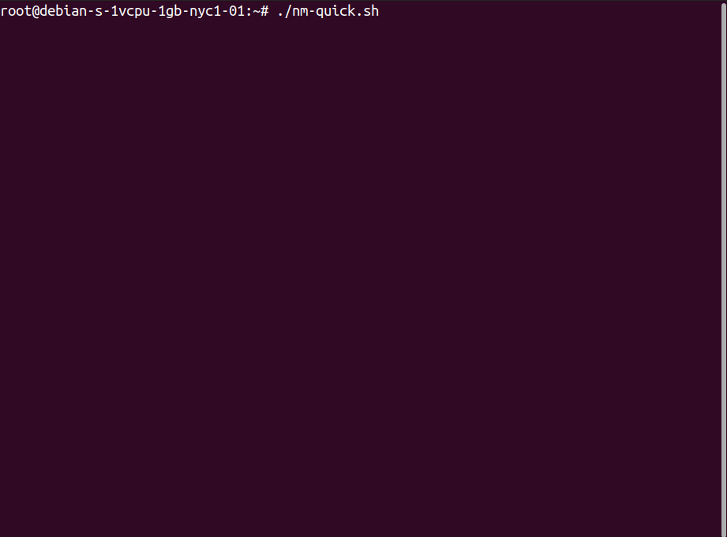

  <break/>

<i>Connect any computers together over a secure, fast, private network, and manage multiple networks from a central server.</i> 

## Documentation

### Netmaker's documentation can be found at:  
###  [docs.netmaker.org](https://docs.netmaker.org)
###  [netmaker.readthedocs.io](https://netmaker.readthedocs.io)
  
## 3 Minute PoC Install

Looking to test out Netmaker as quickly as possible? You'll need:

1. A cloud VM running Ubuntu 20.04 with a public IP
   - DigitalOcean, Linode, AWS, GCP, etc.
2. Open firewall ports 443 and 51821/udp-51830/udp
   - If running behind security groups (AWS, GCP, etc.) make sure they're open there too.
3. Docker, docker-compose, and wireguard installed
    - apt -y install wireguard docker docker-compose

Once this is done, simply run the below command:

`sudo wget -qO https://raw.githubusercontent.com/gravitl/netmaker/develop/scripts/nm-quick.sh | bash`

If this script is not working for you, or you are looking for a more complete, production-ready installation, head over to [the quick start guide](https://docs.netmaker.org/quick-start.html).

## What is Netmaker?
Netmaker is a platform for creating and managing networks that are:

- Fast
- Secure
- Dynamic
- Virtual
- Zero-Trust
- WireGuard-based

Netmaker manages networks between computers that span data centers, clouds, and edge devices. Networking between environments can be a challenge, so Netmaker is designed to allow developers, DevOps engineers, SRE's, and others to manage virtual networks with as little pain as possible. You create a network with a few clicks, and add machines to that network with a single command.

## Why Netmaker?
 1. Create a flat, secure network between multiple/hybrid cloud environments
 2. Integrate central and edge services
 3. Secure a home or office network while providing remote connectivity
 4. Provide an additional layer of security on an existing network
 5. Encrypt Kubernetes inter-node communications
 6. Secure site-to-site connections
 7. Connect to IoT devices
 8. Manage an existing WireGuard setup with less manual configuration

  

#### LICENSE

Netmaker's source code and all artifacts in this repository are freely available. All versions are published under the Server Side Public License (SSPL), version 1, which can be found here: [LICENSE.txt](./LICENSE.txt).

#### CONTACT

Email: info@gravitl.com  
Discord: https://discord.gg/zRb9Vfhk8A

#### Business Support

https://gravitl.com/plans/business

### Disclaimer
 [WireGuard](https://wireguard.com/) is a registered trademark of Jason A. Donenfeld.