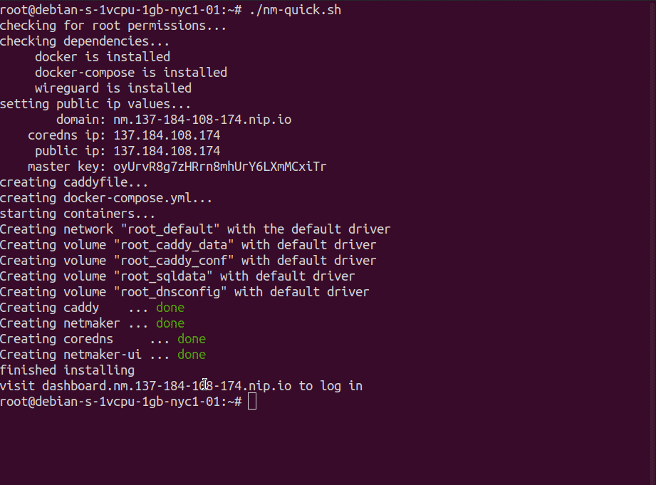

  <break/>

<i>Create and control automated virtual networks.</i> 

! [Docker Pulls](https://img.shields.io/docker/pulls/gravitl/netmaker)! [GitHub closed issues](https://img.shields.io/github/issues-closed-raw/gravitl/netmaker)! [GitHub commit activity](https://img.shields.io/github/commit-activity/w/gravitl/netmaker)! [Twitter URL](https://img.shields.io/twitter/url?style=social&url=https%3A%2F%2Ftwitter.com%2Fgravitlcorp)! [YouTube Channel Views](https://img.shields.io/youtube/channel/views/UCach3lJY_xBV7rGrbUSvkZQ?style=social)

# WireGuard® Automation from Homelab to Enterprise
- [x] Peer-to-Peer Mesh Networks
- [x] Site-to-Site Gateways
- [x] Private DNS
- [x] Kubernetes Multi-Cloud
- [x] Linux, Mac, Windows, iPhone, and Android

# Get Started in 5 Minutes

1. Get a cloud VM with Ubuntu 20.04 and a public IP.
2. Open ports 443, 53, and 51821-51830/udp on the VM firewall and in cloud security settings.
3. Run the script:

`sudo wget -qO - https://raw.githubusercontent.com/gravitl/netmaker/develop/scripts/nm-quick.sh | bash`

(For a more customized install, including using your own domain, head over to [the quick start guide](https://docs.netmaker.org/quick-start.html).)

After installing Netmaker, check out the [Walkthrough](https://itnext.io/getting-started-with-netmaker-a-wireguard-virtual-networking-platform-3d563fbd87f0) and [Getting Started](https://netmaker.readthedocs.io/en/master/getting-started.html) guide to begin setting up networks. Or, check out some of our other [Tutorials](https://gravitl.com/resources) for different use cases, including Kubernetes.

# Why Netmaker + WireGuard?

- Netmaker automates virtual networks between data centers, clouds, and edge devices, so you don't have to.

- Kernel WireGuard offers maximum speed, performance, and security. 

- Netmaker is built to scale from the small business to the enterprise. 

- Netmaker with WireGuard can be highly customized for peer-to-peer, site-to-site, Kubernetes, and more.

# Get Support

- [Community (Discord)](https://discord.gg/zRb9Vfhk8A)

- [Business (Subscription)](https://gravitl.com/plans/business)

- [Email](mailto:info@gravitl.com)

## Disclaimer
 [WireGuard](https://wireguard.com/) is a registered trademark of Jason A. Donenfeld.

## License
Netmaker's source code and all artifacts in this repository are freely available. All versions are published under the Server Side Public License (SSPL), version 1, which can be found here: [LICENSE.txt](./LICENSE.txt).
