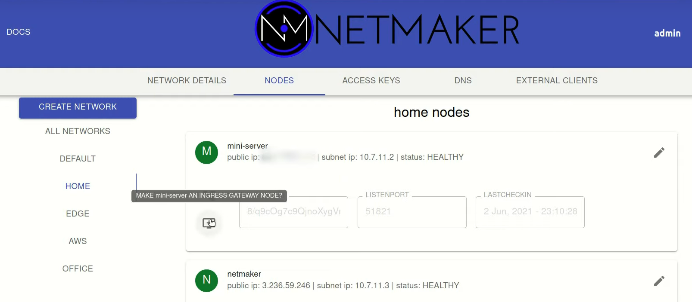
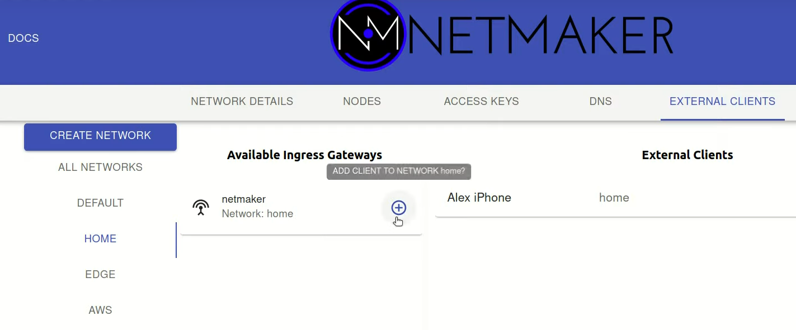
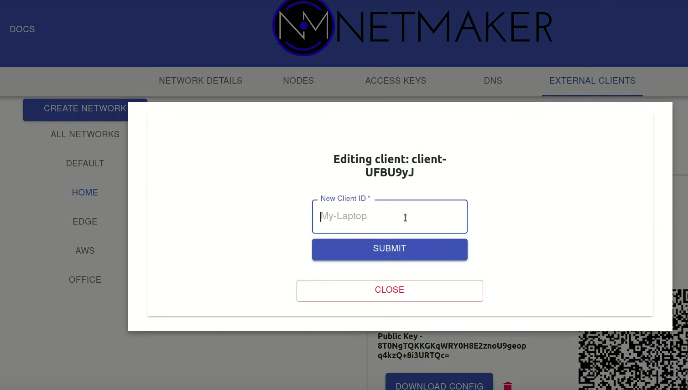
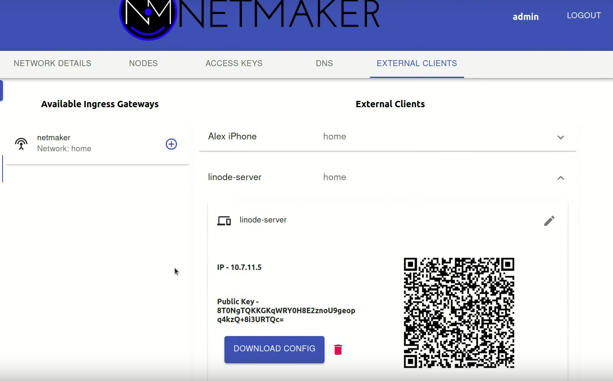
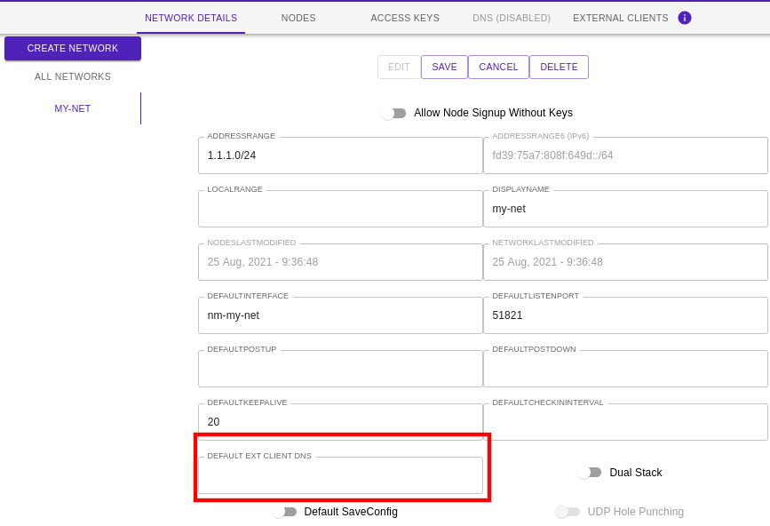

================
External Clients
================

Introduction
===============

Netmaker allows for "external clients" to reach into a network and access services via an Ingress Gateway. So what is an "external client"? An external client is any machine which cannot or should not be meshed. This can include:
        - Phones
        - Laptops
        - Desktops

An external client is not "managed," meaning it does not automatically pull the latest network configuration, or push changes to its configuration. Instead, it uses a generated WireGuard config file to access the designated **Ingress Gateway**, which **is** a managed server (running netclient). This server then forwards traffic to the appropriate endpoint, acting as a middle-man/relay.

By using this method, you can hook any machine into a netmaker network that can run WireGuard.

It is recommended to run the netclient where compatible, but for all other cases, a machine can be configured as an external client.

Important to note, an external client is not **reachable** by the network, meaning the client can establish connections to other machines, but those machines cannot independently establish a connection back. The External Client method should only be used in use cases where one wishes to access resource running on the virtual network, and **not** for use cases where one wishes to make a resource accessible on the network. For that, use netclient.

Configuring an Ingress Gateway
==================================

External Clients must attach to an Ingress Gateway. By default, your network will not have an ingress gateway. To configure an ingress gateway, you can use any node in your network, but it should have a public IP address (not behind a NAT). Your Netmaker server can be an ingress gateway and makes for a good default choice if you are unsure of which node to select.

Adding Clients to a Gateway
=============================

Once you have configured a node as a gateway, you can then add clients to that gateway. Clients will be able to access other nodes in the network just as the gateway node does.

After creating a client, you can edit the name to something more logical.

Then, you can either download the configuration file directly, or scan the QR code from your phone (assuming you have the WireGuard app installed). It will accept the configuration just as it would accept a typical WireGuard configuration file.

Example config file: 

.. literalinclude:: ./examplecode/myclient.conf

Your client should now be able to access the network! A client can be invalidated at any time by simply deleting it from the UI.

Configuring DNS for Ext Clients (OPTIONAL)
============================================

If you wish to have a DNS field on your ext clients conf, simply edit the network field as shown below to 1.1.1.1 or 8.8.8.8 for example.
If you do not want DNS on your ext client conf files, simply leave it blank.

Important to note, your client automatically adds egress gateway ranges (if any on the same network) to it's allowed IPs.
