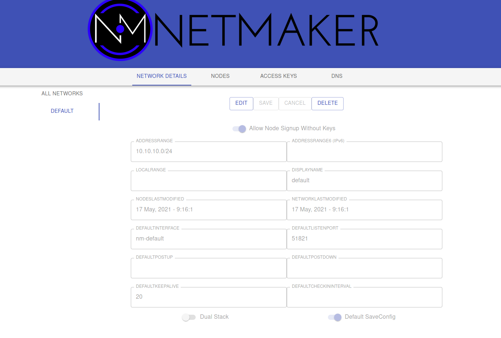

====================
Quick Install
=====================

Introduction
==============

This is an **opinionated** guide for getting up and running with Netmaker as quickly as possible. If this configuration does not fit your use case, see the Advanced Installation docs. 

We assume for this installation that you want all of the features, want your server to be secure, and want it to be accessible from anywhere. 

This instance will not be HA, and is not horizontally scalable. However, it should comfortably handle several hundred clients and most average use cases. If you are deploying for an enterprise use case, please contact info@gravitl.com for support.

By the end of this guide, you will have Netmaker installed on a public VM linked to your custom domain, secured behind an Nginx reverse proxy.

0. Prerequisites
==================
-  **Virtual Machine**
   
   - Preferably from a cloud provider (e.x: DigitalOcean, Linode, AWS, GCP, etc.)
   - Public, static IP 
   - Min 2GB RAM, 1 CPU (4GB RAM, 2CPU preferred)
   - 5GB+ of storage
   - Ubuntu  20.04 Installed

- **Domain**

  - A publicly owned domain (e.x. example.com, mysite.biz) 
  - Permission and access to modify DNS records via DNS service (e.x: Route53)

 #. Docker and Docker Compose installed on the above server. Follow the official `Docker instructions <https://docs.docker.com/engine/install/>`_ for installing Docker and Docker Compose on your system.
 #. All network nodes should be systemd-based (see Compatibility under :doc:`Architecture <./architecture>` docs)

1. Install Dependencies
========================

  ``ssh root@your-host``

Install Docker
---------------
Begin by installing the community version of Docker and docker-compose (there are issues with the snap version).

``sudo apt-get remove docker docker-engine docker.io containerd runc``
 
``sudo apt-get update``
 
    ``sudo apt-get install apt-transport-https ca-certificates curl gnupg lsb-release``

``curl -fsSL https://download.docker.com/linux/ubuntu/gpg | sudo gpg --dearmor -o /usr/share/keyrings/docker-archive-keyring.gpg``
  
  ``echo "deb [arch=amd64 signed-by=/usr/share/keyrings/docker-archive-keyring.gpg] https://download.docker.com/linux/ubuntu $(lsb_release -cs) stable" | sudo tee /etc/apt/sources.list.d/docker.list > /dev/null``
  
``sudo apt-get update``
  
``sudo apt-get install docker-ce docker-ce-cli containerd.io``

``sudo curl -L "https://github.com/docker/compose/releases/download/1.29.2/docker-compose-$(uname -s)-$(uname -m)" -o /usr/local/bin/docker-compose``

``sudo chmod +x /usr/local/bin/docker-compose``

``docker --version``

``docker-compose --version``

At this point Docker should be installed.

Install Dependencies
-----------------------------

``sudo apt install wireguard wireguard-tools nginx certbot python3-certbot-nginx net-tools``

 
2. Prepare VM
===============================

Prepare Domain
----------------------------
1. Choose a base domain or subdomain for Netmaker. If you own **example.com**, this should be something like **netmaker.example.com** 
2. Add an A record pointing to your VM using your DNS service provider for *.netmaker.example.com (inserting your own subdomain of course).
3. Netmaker will create three subdomains on top of this. For the example above those subdomains would be:

    - dashboard.netmaker.example.com

    - api.netmaker.example.com

    - grpc.netmaker.example.com

Moving forward we will refer to your base domain using **<your base domain>**. Replace these references with your domain (e.g. netmaker.example.com).

4. ``nslookup host.<your base domain>`` (inserting your domain) should now return the IP of your VM.

5. Generate SSL Certificates using certbot:

  ``certbot certonly --manual --preferred-challenges=dns --email your@email.com --server https://acme-v02.api.letsencrypt.org/directory --agree-tos --manual-public-ip-logging-ok -d “*.<your base domain>”``

The above command (using your domain instead of <your base domain>), will prompt you to enter a TXT record in your DNS service provider. Do this, and wait a few seconds before clicking enter, or it may fail and you will have to run the command again.

Prepare Firewall
-----------------

Make sure firewall settings are appropriate for Netmaker. You need ports 53 and 443. On the server you can run:

``sudo ufw allow proto tcp from any to any port 443``
``sudo ufw allow dns``

Based on your cloud provider, you may also need to set inbound security rules for your server. This will be dependent on your cloud provider. Be sure to check before moving on.

Prepare Nginx
-----------------

Nginx will serve the SSL certificate with your chosen domain and forward traffic to netmaker.

Add the nginx configuration file:

``wget https://github.com/gravitl/netmaker/TEMPLATE.conf``

Insert your domain in the configuration file and add to nginx:

``sed -i ‘s/NETMAKER_BASE_DOMAIN/<your base domain>/g’ netmaker-nginx-template.conf``

``sudo cp netmaker-nginx-template.conf /etc/nginx/conf.d/<your base domain>.conf``
``sudo cp netmaker-nginx-dns.conf /etc/nginx/nginx.conf``

``nginx -t && nginx -s reload``

``systemctl restart nginx``

[NOTE: May not be necessary. Test with 5353] Prepare for DNS
----------------------------------------------------------------

On Ubuntu 20.04, by default there is a service consuming port 53 related to DNS resolution. We need port 53 open in order to run our own DNS server. The below steps will disable systemd-resolved, and insert a generic DNS nameserver for local resolution. 

1. ``systemctl stop systemd-resolved`` 
2. ``systemctl disable systemd-resolved`` 
3. ``vim /etc/systemd/resolved.conf``
    * uncomment DNS and add 8.8.8.8 or whatever reachable nameserver is your preference
    * uncomment DNSStubListener and set to "no"
4. ``ln -sf /run/systemd/resolve/resolv.conf /etc/resolv.conf``

Install Netmaker
=================

Prepare Templates
------------------

wget netmaker template

``sed -i 's/NETMAKER_BASE_DOMAIN/<your base domain>/g' docker-compose.quickstart.yml``
``sed -i 's/SERVER_PUBLIC_IP/<your server ip>/g' docker-compose.quickstart.yml``

Generate a unique master key and insert it:
``tr -dc A-Za-z0-9 </dev/urandom | head -c 30 ; echo ''``
``sed -i 's/REPLACE_MASTER_KEY/<your generated key>/g' docker-compose.quickstart.yml``

Start Netmaker
----------------
 docker-compose -f docker-compose.quickstart.yml up -d

===========
Quick Start
===========

Setup
=================

#. Create your admin user, with a username and password.
#. Login with your new user
#. Examine the **default** network. Click on DEFAULT under NETWORK DETAILS

This displays information about the **default** network, which is created on server startup. You can delete this network if you do not need it, but for standard use cases this network should be enough to get started. Nodes will get an address from the network address range (ADDRESSRANGE). If the range conflicts with a pre-existing private network on your devices, you may want to change this, or make a new network instead. Nodes will also get default settings from here for unset configurations. For instance, the DEFAULTKEEPALIVE field will set the PersistenKeepAlive for nodes.

To get started quickly, we can just use the existing default network.

Create Key
------------

#. Click on the ACCESS KEYS tab and select the DEFAULT network.
#. Click ADD NEW ACCESS KEY
#. Give it a name (ex: "mykey") and a number of uses (ex: 25)
#. Click CREATE KEY (**Important:** Do not click out of the following screen until you have saved your key details. It will appear only once.)
#. Copy the bottom command under "Your agent install command with access token" and save it somewhere locally. E.x: ``curl -sfL https://raw.githubusercontent.com/gravitl/netmaker/v0.5/scripts/netclient-install.sh | KEY=vm3ow4thatogiwnsla3thsl3894ths sh -``. **A change is required here. Change netclient-install.sh in this command to netclient-install.slim.sh, EX:**

``curl -sfL https://raw.githubusercontent.com/gravitl/netmaker/v0.5/scripts/netclient-install.slim.sh | KEY=vm3ow4thatogiwnsla3thsl3894ths sh -``

.. image:: images/access-key.png
   :width: 80%
   :alt: Access Key Screen
   :align: center

You will use this command to install the netclient on your nodes. There are three different values for three different scenarios: 

* The **Access Key** value is the secret string that will allow your node to authenticate with the Netmaker network. This can be used with existing netclient installations where additional configurations (such as setting the server IP manually) may be required. This is not typical. E.g. ``netclient -c install -k <access key> -s 1.2.3.4 -p 50052``
* The **Access Token** value is a base64 encoded string that contains the server IP and grpc port, as well as the access key. This is decoded by the netclient and can be used with existing netclient installations like this: ``netclient -c install -t <access token>``. You should use this method for adding a network to a node that is already on a network. For instance, Node A is in the **mynet** network and now you are adding it to **default**.
<<<<<<< HEAD

=======
* The **install command** value is a curl command that can be run on Linux systems. It is a simple script that downloads the netclient binary and runs the install command all in one. However, this script is tailored for Secure GRPC Mode and contains an additional (unnecessary) command: **netclient register -k keyvalue**. This command will not work without secure GRPC enabled and will return a 500 error.
  
>>>>>>> c360eb1878a4fe89538235ab240da6f6890934a1
Networks can also be enabled to allow nodes to sign up without keys at all. In this scenario, nodes enter a "pending state" and are not permitted to join the network until an admin approves them.

Deploy Nodes
=================

1. SSH to each machine 
2. ``sudo su -``
3. **Prerequisite Check:** Every Linux machine on which you run the netclient must have WireGuard and systemd installed

  * ``which wg`` (should show wg binary present)
  * ``pidof systemd && echo "systemd found" || echo "systemd not found"``

4. Run the install command, Ex: ``curl -sfL https://raw.githubusercontent.com/gravitl/netmaker/v0.5/scripts/netclient-install.slim.sh | KEY=vm3ow4thatogiwnsla3thsl3894ths sh -``

You should get output similar to the below. The netclient retrieves local settings, submits them to the server for processing, and retrieves updated settings. Then it sets the local network configuration. For more information about this process, see the :doc:`client installation <./client-installation>` documentation. If this process failed and you do not see your node in the console (see below), then reference the :doc:`troubleshooting <./troubleshoot>` documentation.

.. image:: images/nc-install-output.png
   :width: 80%
   :alt: Output from Netclient Install
   :align: center

.. image:: images/nm-node-success.png
   :width: 80%
   :alt: Node Success
   :align: center

Repeat the above steps for every machine you would like to add to your network. You can re-use the same install command so long as you do not run out of uses on your access key (after which it will be invalidated and deleted).

Once installed on all nodes, you can test the connection by pinging the private address of any node from any other node.

.. image:: images/ping-node.png
   :width: 80%
   :alt: Node Success
   :align: center

Manage Nodes
===============

Your machines should now be visible in the control pane. 

.. image:: images/nodes.png
   :width: 80%
   :alt: Node Success
   :align: center

You can view/modify/delete any node by selecting it in the NODES tab. For instance, you can change the name to something more sensible like "workstation" or "api server". You can also modify network settings here, such as keys or the WireGuard port. These settings will be picked up by the node on its next check in. For more information, see Advanced Configuration in the :doc:`Using Netmaker <./usage>` docs.

.. image:: images/node-details.png
   :width: 80%
   :alt: Node Success
   :align: center

Nodes can be added/removed/modified on the network at any time. Nodes can also be added to multiple Netmaker networks. Any changes will get picked up by any nodes on a given network, and will take aboue ~30 seconds to take effect.

Uninstalling the netclient
=============================

1. To remove your nodes from the default network, run the following on each node: ``sudo netclient leave -n default``
2. To remove the netclient entirely from each node, run ``sudo rm -rf /etc/netclient`` (after running the first step)

Uninstalling Netmaker
===========================

To uninstall Netmaker from the server, simply run ``docker-compose down`` or ``docker-compose down --volumes`` to remove the docker volumes for a future installation.

