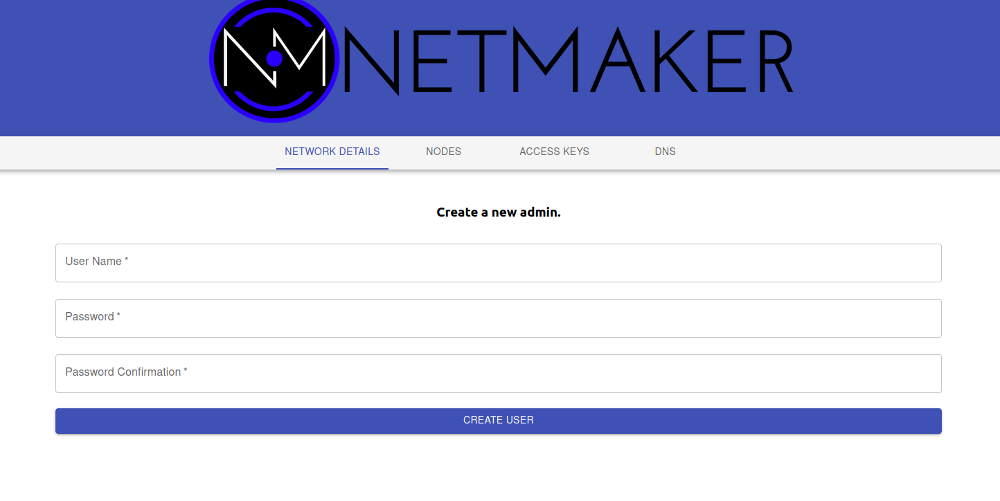

===========
Quick Start
===========

Introduction
==============

This is a guide to getting up and running with Netmaker as quickly as possible. 

By default, Netmaker ships with DNS Mode and Client Mode enabled. However, these features require special permissions and are not necessary for a simple setup, so we are going to deploy without them. To learn more about enabling these features, check out the :doc:`installation docs <./server-installation>`.

Prerequisites
==================
 #. A Linux server to host Netmaker, with an external IP reachable by your nodes (will be referred to as **your-host** in  document).
 #. Docker and Docker Compose installed on the above server. Follow the official `Docker instructions <https://docs.docker.com/engine/install/>`_ for installing Docker and Docker Compose on your system.
 #. All network nodes should be systemd-based (see Compatibility under :doc:`Architecture <./architecture>` docs)

Install
==============
#. ``ssh root@your-host``
#. ``wget -O docker-compose.yml https://raw.githubusercontent.com/gravitl/netmaker/master/scripts/docker-compose.quick.yml``
#. ``sed -i ‘s/HOST_IP/< Insert your-host IP Address Here >/g’ docker-compose.yml``
#. ``docker-compose up -d``

Navigate to the IP address of your host in the browser. You should see the below screen. If not, please see the Quick Start section of the :doc:`troubleshooting <./support>` docs.

Setup
=================

#. Create your admin user, with a username and password.
#. Login with your new user
#. Examine the **default** network. Click on DEFAULT under NETWORK DETAILS

This displays information about the **default** network, which is created on server startup. You can delete this network if you do not need it, but for standard use cases this network should be enough to get started. Nodes will get an address from the network address range (ADDRESSRANGE). If the range conflicts with a pre-existing private network on your devices, you may want to change this, or make a new network instead. Nodes will also get default settings from here for unset configurations. For instance, the DEFAULTKEEPALIVE field will set the PersistenKeepAlive for nodes.

To get started quickly, we can just use the existing default network.

Create Key
------------

#. Click on the ACCESS KEYS tab and select the DEFAULT network.
#. Click ADD NEW ACCESS KEY
#. Give it a name (ex: "mykey") and a number of uses (ex: 25)
#. Click CREATE KEY (**Important:** Do not click out of the following screen until you have saved your key details. It will appear only once.)
#. Copy the bottom command under "Your agent install command with access token" and save it somewhere locally. E.x: ``curl -sfL https://raw.githubusercontent.com/gravitl/netmaker/v0.3/scripts/netclient-install.sh | KEY=vm3ow4thatogiwnsla3thsl3894ths sh -``

.. image:: images/access-key.png
   :width: 80%
   :alt: Access Key Screen
   :align: center

You will use this command to install the netclient on your nodes. There are three different values for three different scenarios: 

* The **Access Key** value is the secret string that will allow your node to authenticate with the Netmaker network. This can be used with existing netclient installations where additional configurations (such as setting the server IP manually) may be required. This is not typical. E.g. ``netclient -c install -k <access key> -s 1.2.3.4 -p 50052``
* The **Access Token** value is a base64 encoded string that contains the server IP and grpc port, as well as the access key. This is decoded by the netclient and can be used with existing netclient installations like this: ``netclient -c install -t <access token>``. You should use this method for adding a network to a node that is already on a network. For instance, Node A is in the **mynet** network and now you are adding it to **default**.
* The **install command** value is a curl command that can be run on Linux systems. It is a simple script that downloads the netclient binary and runs the install command all in one.
  
Networks can also be enabled to allow nodes to sign up without keys at all. In this scenario, nodes enter a "pending state" and are not permitted to join the network until an admin approves them.

Deploy Nodes
=================

1. SSH to each machine 
2. ``sudo su -``
3. **Prerequisite Check:** Every Linux machine on which you run the netclient must have WireGuard and systemd installed

  * ``which wg`` (should show wg binary present)
  * ``pidof systemd && echo "systemd found" || echo "systemd not found"``

4. Run the install command, Ex: ``curl -sfL https://raw.githubusercontent.com/gravitl/netmaker/v0.3/scripts/netclient-install.sh | KEY=vm3ow4thatogiwnsla3thsl3894ths sh -``

You should get output similar to the below. The netclient retrieves local settings, submits them to the server for processing, and retrieves updated settings. Then it sets the local network configuration. For more information about this process, see the :doc:`client installation <./client-installation>` documentation. If this process failed and you do not see your node in the console (see below), then reference the :doc:`troubleshooting <./troubleshoot>` documentation.

.. image:: images/nc-install-output.png
   :width: 80%
   :alt: Output from Netclient Install
   :align: center

.. image:: images/nm-node-success.png
   :width: 80%
   :alt: Node Success
   :align: center

Repeat the above steps for every machine you would like to add to your network. You can re-use the same install command so long as you do not run out of uses on your access key (after which it will be invalidated and deleted).

Once installed on all nodes, you can test the connection by pinging the private address of any node from any other node.

.. image:: images/ping-node.png
   :width: 80%
   :alt: Node Success
   :align: center

Manage Nodes
===============

Your machines should now be visible in the control pane. 

.. image:: images/nodes.png
   :width: 80%
   :alt: Node Success
   :align: center

You can view/modify/delete any node by selecting it in the NODES tab. For instance, you can change the name to something more sensible like "workstation" or "api server". You can also modify network settings here, such as keys or the WireGuard port. These settings will be picked up by the node on its next check in. For more information, see Advanced Configuration in the :doc:`Using Netmaker <./usage>` docs.

.. image:: images/node-details.png
   :width: 80%
   :alt: Node Success
   :align: center

Nodes can be added/removed/modified on the network at any time. Nodes can also be added to multiple Netmaker networks. Any changes will get picked up by any nodes on a given network, and will take aboue ~30 seconds to take effect.

Uninstalling the netclient
=============================

1. To remove your nodes from the default network, run the following on each node: ``sudo netclient -c remove -n default``
2. To remove the netclient entirely from each node, run ``sudo rm -rf /etc/netclient`` (after running the first step)

Uninstralling Netmaker
===========================

To uninstall Netmaker from the server, simply run `docker-compose down`

