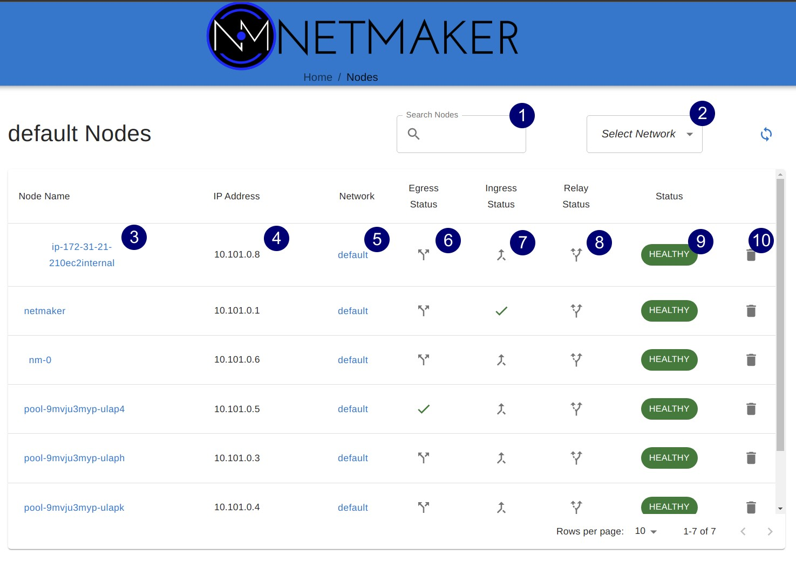
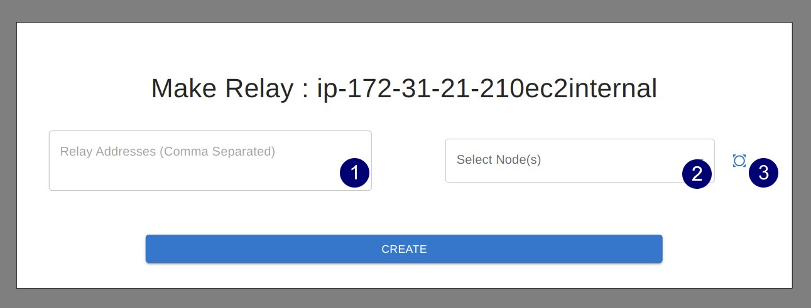
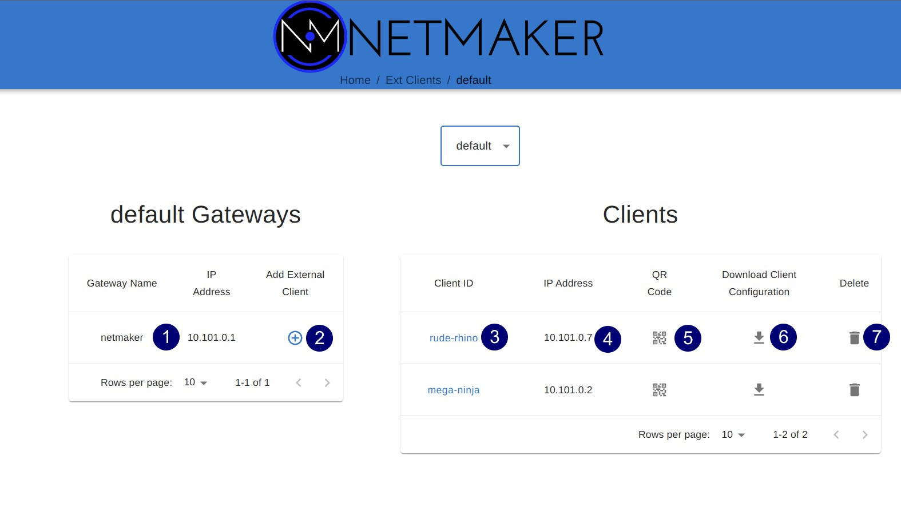
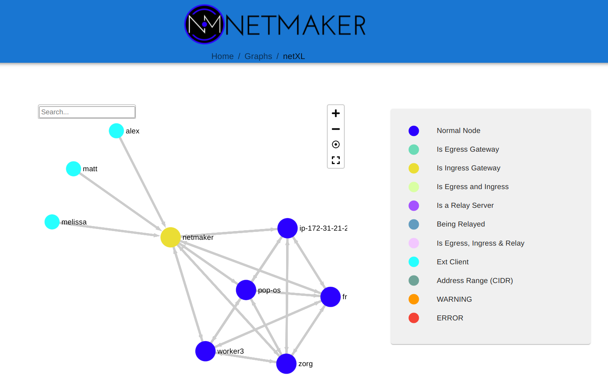
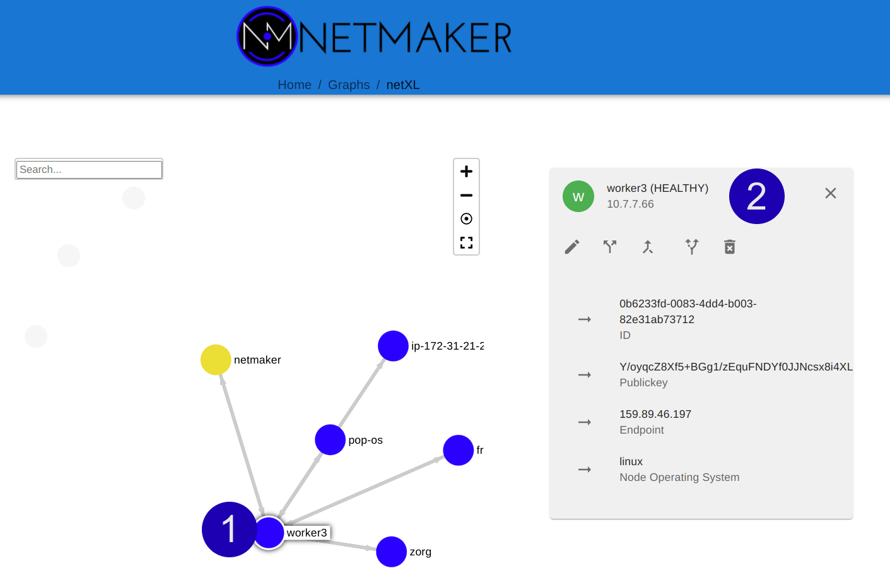

=================
UI Reference
=================

This page contains annotated screenshots of most UI components, detailing the configuration options of each field across Nodes, Networks, DNS, Ext Clients, Users, and more.

Dashboard
=================

.. image:: images/ui-1.jpg
   :width: 80%
   :alt: dashboard
   :align: center

Networks
=================

Create
--------

.. image:: images/ui-2.jpg
   :width: 80%
   :alt: create network
   :align: center

.. code-block::

(1) **Autofill:** Provides sensible defaults for network details and makes up a name.
(2) **Network Name:** The name of the network. Character limited, as this translates to the interface name on hosts (nm-<network name>)
(3) **Address Range:** The CIDR of the network. Must be a valid IPv4 Subnet and should be a private address range.
(4) **Udp Hole Punching:** Enables or disables "UDP Hole Punching" on the network. When on, clients will first reach out to the server. The server will keep track of public addresses / ports and send these to all other clients in the network. This increases NAT traversibility, but can also cause issues depending on the server environment (if server is in a private network, for example). Typically good to enable if clients will "roam" frequently or are user devices. Typically better to disable if most clients will be servers with well-defined endpoints / ports. If enabled, you can also disable UDP Hole Punching on any individual machine via the UI (see Node section) but it will be enabled by default.
(5) **Is Local Network:** Turn on if all clients in the network will be in the same "local" network. This is a very rare situation and depends on the use case. Almost always leave this off. Turn on if you are in a large data center with a large private address space over which clients should communicate. Can also enable if using a VPC and are treating a single client as "egress" for the VPC. If enabled, fill out the address range of the local network which should determine endpoints.
(6) **Is Dual Stack:** Turn on to add private ipv6 addresses to all clients in addition to their ipv4 addresses. Not typically necessary. If on, enter a private ipv6 address range to pull from.

Edit
--------

.. image:: images/ui-3.jpg
   :width: 80%
   :alt: edit network
   :align: center

**NOTE:** With the exception of Address Ranges (1-2) any setting that affects nodes will not take effect on existing nodes. It will only set the settings on any **new** node, after the setting has been changed.

(1) **Address Range (ipv4):** The ipv4 private network CIDR. If edited, Netmaker will go through all nodes and update private addresses based on the new range.** 
(2) **Address Range (ipv6):** The ipv6 private network CIDR. If edited, Netmaker will go through all nodes and update private addresses based on the new range.**
(3) **Local Range:** Only relevant if "Is Local" was switched on during creation. Specifies the local range that nodes will base their Endpoint off of (note: if a node cannot find an enpoint within the range it will fallback to public ip).
(4) **Display Name:** The display name of the network. Network Name cannot be changed (acts as a unique ID) but display name can be changed. Only effects appearance in UI.
(5) **Default Interface:** The default network interface name configured on each node. This defaults to "nm-<network name>".
(6) **Default Port:** The default WireGuard port each node will attempt to use. Nodes will iterate up from this port until they find a free port.
(7) **Default PostUp:** A default post-up command to run on each node (after interface has been configured). Disabled by default to prevent RCE vulnerabilities.
(8) **Default PostDown:** A default post-down command to run on each node (after interface has been removed). Disabled by default to prevent RCE vulnerabilities.
(9) **Default Keepalive:** How often nodes should send packets to keep connection alive with all peers (in seconds).
(10) **Default Ext Client DNS:** If set, adds a "DNS=<value>" line to each ext client config. Set this to add DNS to clients. Typically will set this to the server's public IP.
(11) **Default MTU:** Default MTU for interfaces of all clients in network. Can be useful to set lower in certain difficult environments such as Kubernetes.
(12) **Allow Node Signup Without Keys:** Allows nodes to join the network without a valid Access Key. Nodes will be put in "pending" status until approved via UI by an admin. Useful if an arbitrary number of people need to join the network and there is no easy way to distribute keys to users.
(13) **Is Dual Stack:** Enable the Dual Stack feature of networks and add ipv6 addresses to nodes.
(14) **Default Saveconfig:** Typically ignore this. Sets the SaveConfig field on wireguard config.
(15) **UDP Hole Punching:** Whether or not UDP Hole Punching is turned on (see Network Create notes). Only effects new nodes. Enables or disables "UDP Hole Punching" on the network. When on, clients will first reach out to the server. The server will keep track of public addresses / ports and send these to all other clients in the network. This increases NAT traversibility, but can also cause issues depending on the server environment (if server is in a private network, for example). Typically good to enable if clients will "roam" frequently or are user devices. Typically better to disable if most clients will be servers with well-defined endpoints / ports. If enabled, you can also disable UDP Hole Punching on any individual machine via the UI (see Node section) but it will be enabled by default.

Nodes
========

Node List
-------------

(1) **Search Nodes:** Look up a node by name.
(2) **Select Network:** Filter nodes by network.
(3) **Node Name:** Name of node. By default set to hostname of machine.
(4) **IP Address:** Private IP of node within network.
(5) **Network:** Network the node is in.
(6) **Egress:** Indicates if node is an egress gateway. Click to convert into egress gateway. Egress gateways route traffic from the network into a specific subnet or subnets. Egress gateways should be servers in a static location with a reliable IP.
(7) **Ingress:** Indicates if the node is an ingress. Click to convert into ingress gateway. Ingress gateways route traffic into the network over the WireGuard interface using "ext clients," which are static WireGuard config files. Ingress gateways should be servers in a static location with a reliable IP.
(8) **Relay:** Indicates if the node is a relay. Click to convert into relay. Relays route traffic to specified nodes for the network (typically hard to reach / CGNAT'ted nodes.  Relays should be servers in a static location with a reliable IP.
(9) **Status:** Indicates how recently the node checked into the server. Displays "Warning" after 5 minutes and "Error" after 30 minutes without a check in. Does **not** indicate the health of the node's virtual network connections.
(10) **Delete:** Delete the node.

Create Egress
---------------

.. image:: images/ui-6.jpg
   :width: 80%
   :alt: dashboard
   :align: center

(1) **Egress Gateway Ranges:** A comma-separated list of the subnets for which the gateway will route traffic. For instance, with Kubernetes this could be both the Service Network and Pod Network. For a standard VPN, Netmaker can use a list of the public CIDR's (see the docs). Typically, this will be something like a data center network, VPC, or home network.
(2) **Interface:** The interface on the machine used to access the provided egress gateway ranges. For instance, on a typical linux machine, the interface for public traffic would be "eth0". Usually you will need to check on the machine first to find the right interface. For instance, on Linux, you can find the interface by running this: ip route get <address in subnet>.

Create Relay
-------------

(1) **Relay Addresses:** Specify which private addresses (of nodes) that this node should relay for.
(2) **Select Nodes:** Rather than specify by IP, you can just select from a list of node names instead.
(3) **Select All:** Rather than select a list, you can "select all", which converts the network from "pure mesh" into "hub-and-spoke", meaning there are no p2p connections, everything goes through this relay first.

Edit Node / Node Details
--------------------------

.. image:: images/ui-5.jpg
   :width: 80%
   :alt: dashboard
   :align: center

(1) **IP Address:** The primary private IP address of the node. Assigned automatically by Netmaker but can be changed to whatever you want within the Network CIDR.
(2) **IPv6 Address:** (Only if running dual stack) the primary private IPv6 address of the node. Assigned automatically by Netmaker but can be changed to whatever you want within the Network CIDR.
(3) **Local Address:** The "locally reachable" address of the node. Other nodes will take note of this to see if this node is on the same network. If so, they will use this address instead of the public "Endpoint." If running a few nodes inside of a VPC, home network, or similar, make sure the local address is populated correctly for faster and more secure inter-node communication.
(4) **Node Name:** The name of the node within the network. Hostname by default but can be anything (within the character limits).
(5) **Port:** The port used by the node locally. **This value is ignored if UDP Hole Punching is on,** because port is set dynamically every time interface is created. If UDP Hole Punching is off, the port can be set to any reasonable (and available) value you'd like for the local machine. Typi 
(6) **Public Key:** (Uneditable) The public key of the node, distributed to other peers in the network.
(7) **Endpoint:** The (typically public) IP of the machine, which peers will use to reach it, in combination with the port. If changing this value, make sure Roaming is turned off, since otherwise, the node will check to see if there is a change in the public IP regularly and update it.
(8) **PostUp:** Uneditable by default to disable RCE. Commands to run after the interface is created. If an ingress or egress gateway are created, this field will populate automatically with appropriate iptables commands. 
(9) **PostDown:** Uneditable by default to disable RCE. Commands to run after the interface is brought down. If an ingress or egress gateway are created, this field will populate automatically with appropriate iptables commands.
(10) **Allowed IPs:** Additional private addresses given to the node (in addition to the IPAddress and IPv6Address). Useful in some scenarios where there is a known address a server should have. Any IPs added here will be tacked onto the AllowedIPs of other peers, so this node will be shown to have multiple reachable private addresses.
(11) **Persistent Keepalive:** How often packets are sent to keep connections open with other peers.
(12) **Relay Addresses:** If "Relay" is enabled on this node, this field can be edited to add and remove nodes from the relay. So if you are currently relaying just one node but wish to relay an additional node, just add it's private IP here.
(13) **Node Expiration Datetime:** If a node should become invalid after a length of time, you can set it in this field, after which time, it will lose access to the network and will not populate to other nodes. Useful for scenarios where temporary access is granted to 3rd parties.
(14) **Last Checkin:** Unix timestamp of the last time the node checked in with the server. Used to determine generic health of node.
(15) **Mac Address:** The hardware mac address of the machine. Used to be used as the unique ID, but is being depreciated.
(16) **Network:** The network this 1node belongs to.
(17) **Egress Gateway Ranges:** If Egress is enabled, the gateway ranges that this machine routes to.
(18) **Local Range:** If IsLocal has been enabled on the network, this is the local range in which the node will look for a private address from it's local interfaces, to use as an endpoint.
(19) **Node Operating System:** The OS of the machine.
(20) **MTU:** The MTU that the node will use on the interface. If "wg show" displays a valid handshake but pings are not working, many times the issue is MTU. Making this value lower can solve this issue. Some typical values are 1024, 1280, and 1420.
(21) **Saveconfig:** Usually best to ignore this. Sets the "SaveConfig" value on wireguard config files.
(22) **Is Static:** Ports and Endpoints can be changed automatically by the netclient. Switching on "Is Static" means the port and endpoint will stay the same until you change it. This can be good to set if the machine is a server sitting in a location that is not expected to change. It is also good to have Is Static switched on for Ingress, Egress, and Relay Servers, since they should be in a reliable location.
(23) **UDP Hole Punching:** If on, the node's port will be randomized. The port and endpoint distributed to other nodes are no longer determined by the settings in this file. Instead, the node will "check in" with the server regularly. The server will track the IP and port used to open a connection, and store these values. These values then get distributed to nodes. This is helpful for getting around NAT's which may obscure the node's location.
(24) **Is DNS On:** DNS is solely handled by resolvectl at the moment, which is on many Linux distributions. For anything else, this value should remain off. If you wish to configure DNS for non-compatible systems, you must do so manually.
(25) **Dualstack:** Whether or not this machine should have both a private ipv4 address and ipv6 address.
(26) **Is Local:** If on, will only communicate over the local address (Assumes IsLocal tuned to 'yes' on the network level.)
(27) **Roaming:** If on, will check regularly for changes in the Endpoint and modify the Endpoint value appropriately. This allows a client to "roam" between wifi networks and maintain a connection. Good to keep on for machines where the public address may change.
(28) **IPforwarding:** If on, ipforwarding is enabled on the machine. Should almost always be kept on.

Ext Clients
================

(1) **Gateway Name / IP Address:** Information about which Node is the Ingress Gateway.
(2) **Add External Client:** Button to generate a new ext client.
(3) **Client ID:** The randomly-generated name of the client. Click on the ID to change the name to something sensible. 
(4) **IP Address:** The private ip address of the ext client.
(5) **QR Code:** If joining form iOS or Android, open the WireGuard app and scan the QR code to join the network.
(6) **Download Client Configuration:** If joining from a laptop/desktop, download the config file and run "wg-quick up /path/to/config"
(7) **Delete:** Delete the ext client and remove its network access.

DNS
===========

.. image:: images/ui-10.jpg
   :width: 80%
   :alt: dashboard
   :align: center

(1) **DNS Name:** The private DNS entry. Must end in ".<network name>" (added automatically). This avoids conflicts between networks.
(2) **IP Address:** The IP address of the entry. Can be anything (public addresses too!) but typically a node IP.
(3) **Select Node Address:** Select a node name to populate its IP address automatically.

Create / Edit Users
=====================

.. image:: images/ui-11.jpg
   :width: 80%
   :alt: dashboard
   :align: center

(1) **Username:** Specify Username.
(2) **Password:** Specify password.
(3) **Confirm Password:** Confirm password.
(4) **Make Admin:** Make into a server admin or "super admin", which has access to all networks and server-level settings.
(5) **Networks:** If not made into an "admin", select the networks which this user has access to. The user will be a "network admin" of these networks, but other networks will be invisible/unaccessible.

Node Graph
=====================

View all nodes in your network, zoom in, zoom out, and search for node names. A legend is on the side to identify each node status / configuration.

(1) **hover:** Hover over a node to see its direct connections.
(2) **Configuration Pane:** Manage the node in this pane just like you would in the Nodes pane. See the "Node List" and "Edit Node" sections for more details.
